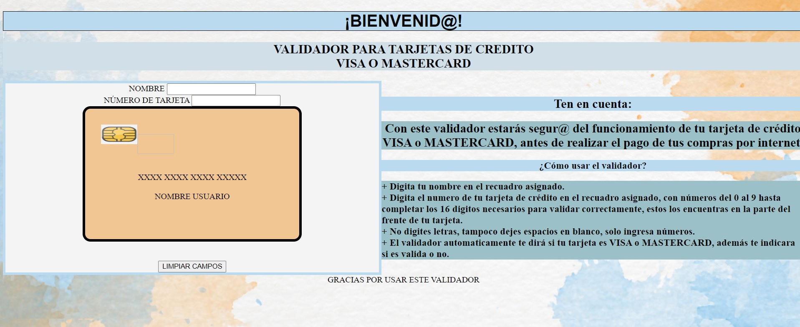
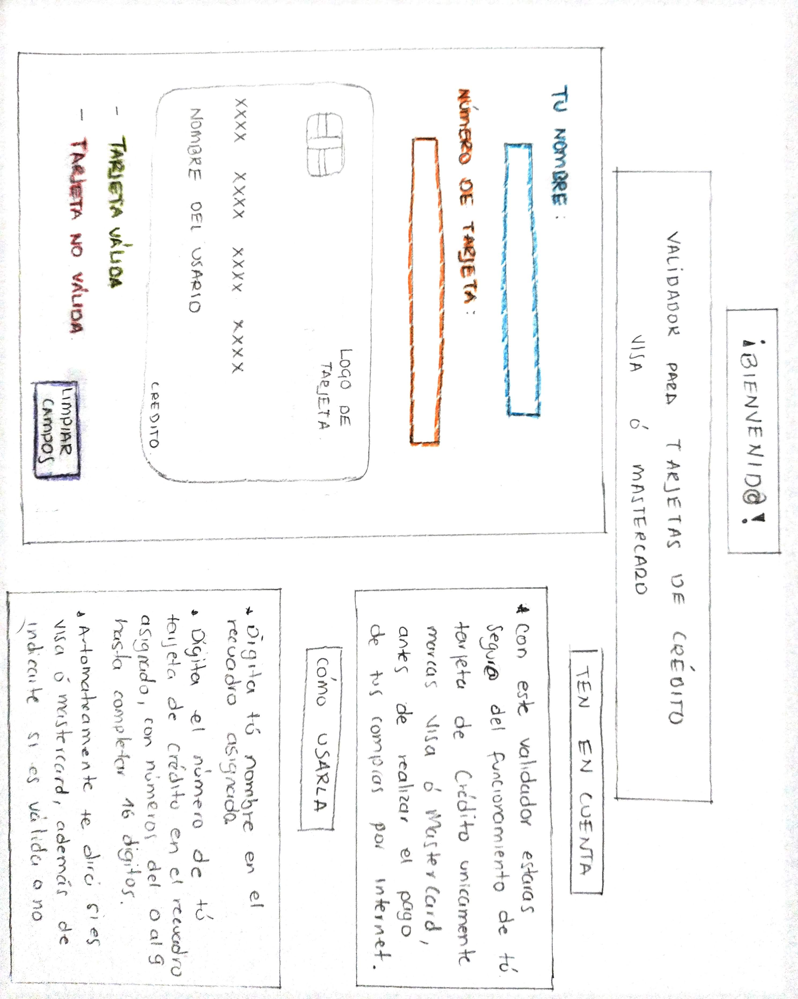

# Validador de Tarjetas de Crédito
***

## 1. ¿De que trata este proyecto?
Este proyecto esta pensado principalmente para usuarios de Tarjetas de Crédito unicamente tipo VISA o MASTERCARD que no estan seguros de si su tarjeta es válida para ser usada en alguna compra por internet, y quieran antes de pagar validar este número en una aplicacion segura y apta para tal verificación.
***

## 2. Imagen del proyecto Final

## 3. Investigacion UX.
### 3.1 ¿Quiénes son los usuarios y los objetivos en relación con el producto?
Los usuarios son todas las personas con Tarjeta VISA o MASTERCARD unicamente.
Los objetivos en relación al producto sera la validación del número de su tarjeta de crédito.

### 3.2 ¿Cómo el producto soluciona los problemas/necesidades de dichos usuarios?
El proyecto ayuda a los usuarios que tengan tarjeta de crédito tipo VISA o MASTERCARD, para estar 100% seguros que si este activa, que funcione y que no tenga problemas con los numeros asignados a la misma, si es que ha pasado un tiempo largo y no la ha usado con frecuencia, asi hará su compra por internet sin inconvenientes.

### 3.3 Mira el prototipo inicial del proyecto:

### 3.4 Aquí veras el Feedback recibido y los cambios que sufrio el proyecto.
Como feedback inicial mis compañeras me sugirieron mostrar en el prototipo en donde encuentra el usuario el numero de tarjeta, asi que puse en las instrucciones que lo ven en su tarjeta fisica en la parte del frente.
***
### 4. Mira la imagen boceto del proyecto

